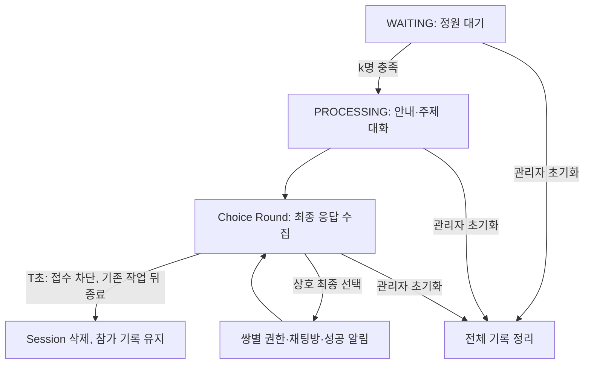

# BlindDate

## 책임

익명 과팅의 참가자 배정, 대화 진행, 선택 접수, 상호 선택 판정과 결과 이벤트를 관리한다.
채팅방 생성과 이후 대화는 Chat 도메인에 위임한다.

## Terminology

- Session: 참가자가 함께 대화하고 선택하는 과팅 단위.
- Choice: 참가자가 한 번 제출하는 최종 상대 선택. `targetId: null`은 명시적인 미선택이다.
- Match: 두 참가자가 서로 선택한 결과.
- Choice Round: 참가자 목록 발행 전에 시작하여 최종 선택 이벤트를 접수하고 30초 타임아웃에 닫는 단계.

## 주요 흐름과 규칙

정원 충족 → 안내 및 대화 → Choice Round 개설과 참가자 목록 발행 →
최종 선택 이벤트 순차 처리 → 상호 선택 쌍별 즉시 채팅방 생성·성공 알림.
30초 타임아웃은 새 접수를 차단하고 앞서 접수된 세션 작업 뒤에서 Session만 종료한다.

프론트가 10초 선택 시간을 관리하고 종료 후 각 참가자의 최종 Choice를
`/app/blinddate/choice`에 제출한다. 본문은 `{"targetId":123}` 또는 미선택의 경우
`{"targetId":null}`이다. 선택자와 세션은 인증된 소켓 속성에서 가져온다.
기존 DTO에서는 targetId가 누락된 `{}`도 null로 역직렬화되어 미선택으로 접수된다.

서버는 참가자 목록 발행 후 30초 타임아웃을 둔다. 참가자 목록을 발행하기 전에 응답 대상을 고정한다.
연결이 끊긴 참가자도 응답 대상에 남고 타임아웃 전에 재접속하여 제출할 수 있다.
타임아웃은 미응답을 null로 채우거나 매칭·결과 알림을 실행하지 않는다.
타이머 등록 실패 시 같은 종료 경로로 접수를 닫아 세션이 계속 남는 것을 방지한다.
타이머 콜백에서 접수를 즉시 닫고, 이미 접수된 선택과 실행 중인 채팅방·알림 작업 뒤에 종료 작업을 넣는다.
타이머 지연은 접수 기간을 늘릴 수 있고 느린 기존 작업은 실제 상태 종료를 지연시킬 수 있다.
엄격한 30초 도착 기한 또는 30초에 모든 외부 작업 중단을 보장하는 정책은 아니다.
운영 종료 후 기존 30분 정리 또는 관리자 초기화로 참가 기록을 정리한다.
서버는 클라이언트의 10초 경과를 검증하지 않으므로 접수가 열린 직후 제출된 요청도 유효하다.

회원별 최초 유효 응답만 반영한다. 미선택 역시 응답이며 이후 상대 선택으로 변경할 수 없다.
다른 참가자의 응답이나 타임아웃을 기다리지 않는다. 상대의 최종 응답과 상호 선택이면 그 이벤트에서 매칭한다.
전원 응답하더라도 Session은 30초 타임아웃까지 유지하며 추가 최종 선택 변경은 허용하지 않는다.

## 선택 입력 검증과 오류 응답

선택자와 대상은 Choice Round에 고정된 참가자 목록에 속해야 한다.
미선택은 유효하며 자기 선택은 허용하지 않는다. 잘못된 응답은 최초 응답 기회를 소비하지 않는다.
접수 시작 전이나 종료된 Session의 요청은 무시한다. 종료는 Session 삭제로 표현되며 별도 TERMINATED enum은 없다.

오류는 연결을 종료하는 STOMP ERROR 대신 개인별
`/topic/blinddate/session/{sessionId}/member/{memberId}/choice-error`에 전달한다.
응답 필드는 `status`, `code`, `message`이다.

| 조건 | status | code |
| --- | --- | --- |
| 선택자가 해당 Choice Round의 참가자가 아님 | 403 | CHOICE_FORBIDDEN |
| 자기 자신 선택 | 400 | INVALID_CHOICE |
| 해당 Choice Round에 대상이 없음 | 404 | CHOICE_TARGET_NOT_FOUND |

## 저장 구조와 동시성

`BlindDateParticipantStorageImpl`의 `sessionId → ChoiceRound`가 고정 참가자 목록,
회원별 최종 응답과 `claimedMembers` 쌍별 멱등 상태를 함께 관리한다. 미응답과 미선택은 `containsKey`로 구분한다.
세션별 잠금으로 최초 응답을 저장하고 상호 선택한 두 회원의 처리 권한을 한 번만 획득한다.
쌍별 권한은 채팅방·알림 생성 전에 획득하고 실패해도 해제하지 않아 중복 요청으로 재실행하지 않는다.
참가자 입장 기록과 함께 운영 정리·관리자 초기화에서 전체 삭제한다.

`BlindDateEventQueue`는 참여 이벤트를 전역 단일 스레드에서, 최종 선택·매칭·알림·종료를 세션별 직렬 큐에서
처리한다. 선택 처리 진입과 채팅방 생성 전에 PROCESSING 상태를 검사하여 종료된 Session의 새 매칭을 막는다.
타임아웃은 접수를 닫고 같은 세션 큐에 종료 작업만 제출한다. 앞서 접수된 선택은 종료 전에 처리된다.
접수 개설과 전체 초기화는 같은 잠금에서 조정한다. 초기화가 대기·실행 중이면 새 접수 개설을
거부하며, 초기화 후에는 현재 세션 상태를 다시 검사해 종료된 세션을 다시 열지 않는다.
중복 요청은 최초 응답·쌍별 권한으로 무시된다. 다른 세션은 5개의 공용 worker에서 병렬 실행한다.

각 상호 선택 쌍은 다른 쌍이나 미응답 회원을 기다리지 않고 한 번만 채팅방을 생성한다.
성공 즉시 기존 개인별 chatroom 토픽에 `chatRoomId`를 보내고 두 회원에게 저장 알림·푸시를 시도한다.
실패 토픽은 더 이상 발행하지 않으며 별도 마감 이벤트도 추가하지 않는다. 입력 검증의 choice-error는 유지한다.
성공 이벤트는 개인별로 발행하며 Session 전체 일괄 결과 확정은 하지 않는다.

## 화면 종료와 성공 알림 계약

프론트는 선택 시작 안내와 로컬 10초 타이머를 관리하고, 종료 후 최종 선택 또는 null을 제출한다.
결과 대기 화면이나 실패·마감 이벤트에 의존하지 않고 “매칭되면 알림으로 알려드릴게요.”라고 안내한다.
이 PR은 프론트 화면이나 최종 선택 접수 ACK·재시도를 구현하지 않는다. 전송 직후 소켓을 닫으면
최종 선택이 누락될 수 있으므로 실제 프론트 전환에서 전송 완료·접수 확인 계약을 별도로 합의해야 한다.

`BlindDateMatchNotification`은 기존 Notification 저장 서비스를 통해 성공 알림을 먼저 커밋하고,
기존 채팅 이동 계약인 `type=CHAT`, `value=chatRoomId`로 푸시한다. CHAT 알림 설정을 따른다.
푸시를 받지 못해도 저장된 성공 알림은 기존 알림 목록에서 확인할 수 있다.
채팅방 저장소도 기존 Chat 도메인을 그대로 사용하며 별도 매칭 결과 테이블/API는 추가하지 않는다.
알림 없음은 실패 확정을 뜻하지 않는다. 접수 중·미매칭·채팅방 생성 실패·알림 저장 실패를
구분하는 실패 결과 조회는 제공하지 않는다.

| 시나리오 | 결과 |
| --- | --- |
| 상호 선택, 나머지 회원 미응답 | 두 번째 최종 선택 이벤트에서 즉시 채팅방 생성·성공 소켓·저장 알림·푸시 |
| 한 회원 최종 선택 후 연결 해제, 상대가 최종 선택 | 기존 선택 유지, 상호 선택이면 즉시 성공 알림 |
| 전원 미선택·순환 선택·전원 미응답 | 채팅방·성공/실패/마감 이벤트 없이 30초 타임아웃에 세션 종료 |
| 한 쌍 채팅방 생성 실패 | 해당 쌍 알림 없음, 다른 성공 쌍은 계속 처리 |
| 회원별 소켓·알림 저장·푸시 예외 | 다른 회원 처리 계속; 타임아웃은 종료만 하고 재발송하지 않음 |
| 푸시 실패 | 저장 서비스 커밋이 성공한 알림은 유지 |
| 종료된 세션·타임아웃 후 늦은 선택 | 새 매칭·채팅방·알림 없음 |
| 채팅방 생성 중 타임아웃 | 새 접수 차단, 진행 중 작업을 완료한 뒤 종료; 중간 취소·롤백 없음 |

## 제약과 실패 처리

상태와 큐는 프로세스 내부에 있다. 다중 서버 처리와 재시작 복구는 지원하지 않는다.
쌍별 권한은 한 프로세스 안의 중복 실행 방지이며 DB와 소켓 전송의 분산 트랜잭션을 보장하지 않는다.

채팅방 생성이 실패하면 해당 쌍의 성공 알림을 보내지 않고 오류를 기록하며 다른 쌍은 계속 처리한다.
개인별 전송 예외를 각각 기록하여 나머지 수신자 전송을 계속하며 타임아웃에서 세션을 종료한다.
DB 커밋 후 호출 실패처럼 외부 작업의 성공 여부가 불명확한 경우의 보상은 포함하지 않는다.
결과 재전송·클라이언트 수신 확인은 제공하지 않는다. 전송 호출 반환은 실제 수신을 뜻하지 않는다.
알림 저장 실패의 자동 복구나 outbox는 없다. 저장 후 푸시는 별도 호출이며 원자적이지 않다.

느린 채팅방 생성은 같은 세션의 결과를 지연시키고 공용 worker가 모두 점유되면 다른 세션도 대기한다.
성공 알림 저장·푸시도 같은 세션 worker에서 실행하므로 느린 외부 호출은 세션 종료를 지연시킬 수 있다.
프론트는 성공이 선택 화면 종료 전에도 올 수 있고 실패·마감 이벤트는 오지 않는다는 계약을 반영해야 한다.

## 전체 진행 계약

### 시간·인원 기호와 현재 값

| 기호 | 의미 | 현재 구현 | 설정 위치 / 소유자 |
| --- | --- | --- | --- |
| k | 세션 정원 | 개최 요청의 `maxSessionMemberCount` | `StartBlindDateRequest` |
| n | 이벤트별 대화 시간(분) | 3분 | Scheduler의 `CHATTING_TIME`, 상수이며 런타임 설정 아님 |
| a | 요청한 이벤트 메시지 수 | 기본 3개 | `blinddate.event-message-amount` |
| a′ | 실제 이벤트 메시지 수 | `min(a, 8)` | MessageProvider의 주제 8개에서 중복 없이 무작위 선정 |
| m | 프론트 선택 UI 시간(초) | 10초로 합의 | 프론트 책임, 이 저장소에서 실제 UI 동작을 검증하지 않음 |
| T | 서버 접수·세션 종료 타임아웃(초) | 30초 | Scheduler의 `CHOICE_TIMEOUT` |
| g | 과거 일괄 집계 후보의 여유 시간(초) | 현재 결과 대기 시간이 아님 | 이전 12초 후보에서 2초 |

`n`, `a`, `m`은 서로 다른 값이다. `n`분 대화를 a′회 진행한 뒤 m초 선택 UI를 제공한다.
서버는 UI 선택 시간을 재지 않고 최종 요청을 기다린다. a는 주제 풀 크기까지만 반영된다.
a=0 또는 음수는 정상 진행 계약이 아니며, 현재 코드가 빈 주제의 첫 항목을 접근하거나
잘못된 subList 범위를 만들 수 있다. 유효한 설정 범위와 동적 안내 문구는 후속 구현 검토 대상이다.

### 상태와 단계

저장된 SessionState는 `WAITING`, `PROCESSING`이다. 종료 시 Session을 삭제한다.
아래 안내·대화·선택·결과 확정은 설명용 단계이며 별도 저장된 enum 상태가 아니다.

운영 종료 후 지연 정리도 전체 기록 정리 경로를 사용한다. 외부 작업 실행 중 초기화는
앞서 제출된 세션 작업 완료를 기다리므로 즉시 중단·롤백하는 기능은 아니다.

### 정상 진행 순서

1. 인증된 소켓이 `/user/queue/blinddate/join`을 구독하면 입장을 요청한다.
2. 참여 큐에서 회원의 기존 참가 기록을 확인하고 대기 Session을 배정한다.
   입퇴장은 같은 단일 스레드 큐에 제출되어 하나씩 직렬 처리된다.
   `execute()`가 입장 완료까지 기다리는 동기 API는 아니며, 네트워크 도착 순서를 별도로 보장하지 않는다.
3. 새 회원을 등록하고 개인 JOIN 응답으로 sessionId·익명 이름·현재 인원·정원을 전달한다.
4. 정원 미달이면 `joined`로 인원을 갱신한다. 마지막 회원이 k명을 채우면 Session을
   PROCESSING으로 전환하고 별도 진행 스레드에서 시작한다. 마지막 입장은 JOIN 후
   시작 경로로 진입하므로 `joined`가 k명으로 한 번 더 발행된다고 가정하지 않는다.
5. 구독 여유 1초 → START → 추가 1초 → FREEZE 순서로 진행한다.
6. 안내 메시지 7개를 SYSTEM으로 순서대로 보내며 각 발행 뒤 2초씩 기다린다.
7. 첫 주제에서 FREEZE → SYSTEM(주제) → 4초 후 THAW를 발행한다.
   THAW부터 n분 대화한 뒤 다음 주제로 넘어간다. 다음 주제도 같은 순서를 반복한다.
   주제 발행 간격은 정확히 n분이 아니라 대체로 **n분 + 읽기 대기 4초**다.
8. a′번째 주제의 THAW 후에도 n분 대화하고 Choice Round를 연다.
   응답 대상을 고정하고 접수를 연 뒤 `participants`를 발행한다.
9. 프론트는 participants 수신을 선택 시작 신호로 사용하고 m초 UI를 제공한다.
   UI 종료 후 각 참가자가 최종 targetId 또는 null을 한 번 제출한다.
   미선택도 반드시 제출한다. 프론트가 보내지 않은 요청은 서버에서 미응답이다.
10. 최종 선택 이벤트마다 최초 응답을 저장하고 상호 선택이면 즉시 쌍별 처리 권한을 획득한다.
    해당 채팅방을 생성하고 성공 소켓·저장 알림·푸시를 시도한다. 다른 회원의 응답을 기다리지 않는다.
11. 전원 응답 이후에도 접수·Session은 타임아웃까지 유지된다. 타임아웃은 새 접수를 막고
    기존 작업 뒤에서 Session만 삭제한다. 미응답 보충·매칭·실패·마감 이벤트는 없다.
    참가 기록은 재입장 방지를 위해 유지한다. 최종 선택 접수 ACK나 성공 소켓 재전송은 없다.

기본 a=3, n=3이면 주제 대화만 9분이다. 구독 여유 2초 + 안내 대기 14초 + 주제 읽기
대기 12초를 포함하면 선택 목록 발행까지 명목상 약 **9분 28초**다. 작업 지연·전송 소요는 별도다.
현재 안내에 포함된 “15분간 진행”, “총 3개의 질문”은 고정 문자열이므로 실제 시간 또는
변경된 a와 일치한다고 보장하지 않는다. 이 PR에서는 해당 문구나 운영 코드를 바꾸지 않는다.

### 참가 기록 초기화 REST API

프론트에서 전달한 `method=DELETE`, `endpoint=/participants`는 컨트롤러의
`/blinddate` 기본 경로를 합치면 **`DELETE /blinddate/participants`**다.
소켓의 선택 목록 이벤트 `/topic/blinddate/session/{sessionId}/participants`와는 별개다.

| 항목 | 현재 계약 |
| --- | --- |
| 권한 | 관리자 (`ADMIN_ROLE`) |
| 요청 본문 | 없음 |
| 정상 응답 | `204 No Content`, 응답 본문 없음 |
| 초기화 범위 | 특정 회원이 아니라 전체 Session·참가 기록·Choice Round·대기 Session 포인터 |
| 유지되는 정보 | 과팅 운영 상태·정원·개최 만료 시각·자동 종료 예약 |
| 처리 시점 | 정리 큐에 작업 제출 후 응답; 204가 전체 정리 완료를 뜻하지 않음 |
| 기존 호환 경로 | `POST /blinddate/participants`도 같은 동작으로 지원 |

종료된 Session의 참가 기록도 초기화하므로 정리 완료 후 운영 중인 경우 다시 참가할 수 있다.
개별 회원의 자발적 퇴장 API로 사용하지 않는다. 진행 중인 Session도 정리 대상이며,
이미 실행 중인 결과 처리의 외부 채팅방 생성은 취소하거나 롤백하지 않는다.

### 소켓 방향과 의미

아래 Session 토픽은 `/topic/blinddate/session/{sessionId}`에 상대 경로를 붙인다.

| 방향 | 목적지 / 상대 경로 | 의미 / 주요 payload |
| --- | --- | --- |
| 클라이언트 SUBSCRIBE | `/user/queue/blinddate/join` | 입장 요청 트리거 및 JOIN 응답 구독 |
| 서버 → 개인 | 위 JOIN 구독 경로 | name, sessionId, state, volunteer, maxCount; 실패·종료는 state만 전달 가능 |
| 서버 → Session | `/joined` | 인원 갱신, `volunteer` |
| 서버 → Session | `/start` | 진행 시작, `sessionId` |
| 서버 → Session | `/freeze`, `/thaw` | UI 대화 비활성화·활성화, `type` |
| 서버 → Session | `/system` | 안내·주제, message, senderId=0, senderName, timestamp |
| 클라이언트 SEND | `/app/blinddate/message` | 사용자 대화, message |
| 서버 → Session | `/message` | 사용자 대화, message, senderId, senderName, timestamp |
| 서버 → Session | `/participants` | **선택 UI 시작 신호**, participants(회원 ID → 익명 이름) |
| 클라이언트 SEND | `/app/blinddate/choice` | **최종 선택 응답**, `targetId` 또는 null; 서버가 보낸 choice 이벤트 아님 |
| 서버 → 개인 | `/member/{memberId}/choice-error` | 잘못된 입력, status/code/message; 최종 실패 아님 |
| 서버 → 개인 | `/member/{memberId}/chatroom` | 성공, `chatRoomId` |
| 과거 경로(미발행) | `/member/{memberId}/failed` | 현재 실패 이벤트를 보내지 않음 |

FREEZE/THAW는 UI 제어 이벤트다. 현재 MessageHandler는 회원의 익명 이름 존재 여부만
확인하고 브로드캐스트하며, 서버에서 FREEZE 상태나 선택 단계·종료 여부를 강제 검사하지 않는다.
또한 마지막 주제 종료 시 별도 FREEZE를 발행하지 않는다. “선택 중 채팅 금지”를 서버의
보안 보장으로 해석하면 안 된다. 정확한 단계별 전송 제한은 후속 정책·구현 검토 사항이다.

## 시나리오 목록

각 행은 QA·후속 테스트에 사용할 입력과 관찰 결과다. 아래 목록 전체가 자동 테스트로
검증됐다는 뜻은 아니다. 현재 코드의 관찰 결과와 별도 검토가 필요한 한계도 함께 표시한다.
ID는 문서 시나리오 ID이며 테스트 메서드 이름에 결합하지 않는다.

### 입장·퇴장·세션 배정

| ID | 조건 / 행동 | 현재 기대 결과 또는 한계 |
| --- | --- | --- |
| J01 | 운영 중 첫 회원 입장 | 새 WAITING Session과 익명 이름 배정, 개인 JOIN 응답 |
| J02 | k−1명까지 순서대로 입장 | 같은 대기 Session에 배정, 시작하지 않음 |
| J03 | k번째 회원 입장 | 정원을 충족한 Session을 PROCESSING으로 전환하고 진행 시작 |
| J04 | 꽉 찬 Session 뒤 새 회원 입장 | 새 대기 Session을 만들어 배정, 기존 Session에 추가하지 않음 |
| J05 | 여러 회원이 동시에 입장 | 참여 큐의 실행 순서로 배정, 소켓 수가 아니라 회원 수로 정원 판단 |
| J06 | 같은 회원의 두 번째 소켓 입장 | 같은 Session·익명 이름, 소켓만 추가; 인원 증가 없음 |
| J07 | 같은 소켓의 입장 요청 반복 | 소켓 집합은 중복 등록되지 않음; JOIN 재응답은 가능 |
| J08 | WAITING 회원의 소켓 하나 해제, 다른 소켓 존재 | 소켓만 제거, 참가자·인원 유지 |
| J09 | WAITING 회원의 마지막 소켓 해제 | 참가자 제거, 인원 갱신; 정원 미달 상태 유지 |
| J10 | 마지막 입장과 퇴장이 동시에 제출됨 | 참여 큐 순서에 따라 시작 여부 결정; 먼저 시작하면 뒤의 해제는 진행 중 이탈로 처리 |
| J11 | PROCESSING 회원의 마지막 소켓 해제 | 연결만 제거, 참가자·고정 응답 대상 유지; 이탈 즉시 미선택 처리하지 않음 |
| J12 | 진행 중 이탈 회원 재접속 | 기존 Session·익명 이름 복구, 소켓 역인덱스 갱신, JOIN 재응답 |
| J13 | 종료된 Session 참가 회원 재접속 | JOIN에 TERMINATED 안내, 새 Session에 자동 편입하지 않음 |
| J14 | 알 수 없는 소켓·중복 해제 | 다른 회원을 제거하지 않음, 찾을 수 없는 소켓은 로그 후 종료 |
| J15 | 참가 등록 전 예외 | JOIN에 실패한 요청의 sessionId 속성 제거, 기존 정상 참가자를 삭제하지 않음 |
| J16 | 참가 등록 후 JOIN 전송·정원 조회 실패 | FAILED 안내를 시도하고 퇴장 큐에 롤백 제출; 요청 반환 시 즉시 롤백 완료를 보장하지 않음 |
| J17 | 운영하지 않을 때 입장 | 입장 거부; 현재 실행 진입 전 가용성을 검사 |
| J18 | 가용성 검사 이후 운영 종료, 입장 작업은 이미 큐에 있음 | 처리 시 가용성 재검사가 없어 종료 직전 접수의 편입 가능성은 남아 있음 |
| J19 | PROCESSING 소켓 해제와 Choice Round 개설이 겹침 | 참가자 기록이 유지되므로 응답 대상에서 빠지지 않음 |
| J20 | 종료 후 소켓 해제 | 현재 DisconnectHandler는 삭제된 Session이면 바로 반환; 소켓 기록 정리까지 보장하지 않음 |

### 안내·이벤트·대화

| ID | 조건 / 행동 | 현재 기대 결과 또는 한계 |
| --- | --- | --- |
| P01 | 정원 충족 | 구독 여유 후 START, 이후 FREEZE·안내 메시지 순차 발행 |
| P02 | 정상 안내 진행 | 7개 안내가 2초 대기로 순서대로 발행; 안내 중 UI 대화 비활성화 |
| P03 | 주제 하나 발행 | FREEZE → SYSTEM 주제 → 4초 뒤 THAW |
| P04 | 주제 대화 n분 종료, 다음 주제 존재 | 다음 FREEZE·주제·THAW 진행; 무작위 선정한 주제의 순서대로 발행 |
| P05 | a′번째 주제 발행 | 주제를 보내자마자 선택을 시작하지 않고, THAW 후 n분 대화까지 제공 |
| P06 | 마지막 대화 종료 | 응답 대상 고정·접수 개설 후 participants 발행, 최종 선택 요청 수집 |
| P07 | a가 주제 풀 크기보다 큼 | 실제 a′는 8개, 요청한 수만큼 새 주제를 생성하지 않음 |
| P08 | a가 0 또는 음수 | 정상 진행을 보장하지 않음; 설정 검증 필요 |
| P09 | FREEZE 중 임의 클라이언트가 메시지 SEND | UI는 막을 수 있으나 서버의 단계 검사로 차단되지 않음 |
| P10 | 선택 중·종료 후 기존 속성으로 메시지 SEND | MessageHandler의 Session 상태 검사가 없어 차단을 보장하지 않음 |
| P11 | 진행 중 재접속 | JOIN 재응답만 있으며 이전 안내·현재 주제·remaining time을 재전송하지 않음 |
| P12 | 스케줄러 실행 지연 | 다음 이벤트와 선택 시작이 늦어질 수 있음; 절대 시각 기반 진행 보장 없음 |
| P13 | 안내 진행 스레드 중단 또는 진행 이벤트 전송 예외 | Session 종료 작업 제출; 참가자별 최종 실패 이벤트를 모두 보낸다는 보장 없음 |
| P14 | 이미 정리된 Session의 오래된 이벤트 작업 | 상태 검사 경로에서 중단할 수 있으나 모든 THAW·전송의 원자적 차단을 보장하지 않음 |

### 선택 입력·응답 수집

| ID | 조건 / 행동 | 현재 기대 결과 또는 한계 |
| --- | --- | --- |
| C01 | Choice Round 개설 전 최종 선택 제출 | 접수하지 않음; 참가 등록만으로 선택 가능하지 않음 |
| C02 | participants 발행 직후 즉시 최종 선택 제출 | 서버는 m초 경과를 검증하지 않으므로 최초 유효 응답으로 접수 |
| C03 | m초 UI 종료 후 대상 한 명 제출 | 최초 응답 저장; 상대도 본인을 최종 선택했으면 즉시 채팅방·성공 알림 |
| C04 | `targetId:null` 제출 | 명시적인 미선택 응답으로 인원수에 포함 |
| C05 | targetId가 누락된 `{}` 제출 | 기존 DTO 역직렬화에서 null, 미선택으로 접수 |
| C06 | 아무 요청도 보내지 않음 | 미응답 유지; 다른 상호 선택 쌍의 매칭을 막지 않으며 T에 Session만 종료 |
| C07 | 동일 회원의 선택·미선택 요청 반복 | 응답 수는 한 명, 최초 유효 응답 유지 |
| C08 | 상대 A를 제출 후 상대 B로 변경 | 첫 응답 A 유지; 서버가 UI 중간 선택을 저장하는 정책 아님 |
| C09 | 미선택 제출 후 상대 선택으로 변경 | 첫 미선택 유지 |
| C10 | 자기 자신 선택 | choice-error에 400 / INVALID_CHOICE; 정상 응답 기회는 유지 |
| C11 | 해당 Choice Round 참가자가 아닌 선택자 | choice-error에 403 / CHOICE_FORBIDDEN |
| C12 | 없는 회원 또는 다른 Session의 상대 선택 | choice-error에 404 / CHOICE_TARGET_NOT_FOUND |
| C13 | 잘못된 선택 후 정상 선택 제출 | 잘못된 입력을 인원수에 넣지 않고 정상 최초 응답 접수 |
| C14 | 대상의 모든 소켓이 해제됨 | 고정 참가 목록에 있으므로 선택 대상 허용; 해당 대상 응답은 별도로 필요 |
| C15 | 같은 회원의 여러 소켓이 동시에 제출 | 첫 유효 응답 하나만 반영, 소켓별로 응답 수를 늘리지 않음 |
| C16 | 상호 선택을 완성하는 유효 응답 도착 | 다른 참가자 미응답이어도 쌍별 권한 획득·즉시 채팅방·두 성공 알림 |
| C17 | 같은 회원 중복 응답 또는 종료 뒤 추가 응답 | 최초 응답 유지 또는 종료 검사로 무시; 추가 채팅방·알림 없음 |
| C18 | 서로 다른 Session에서 동시에 제출 | Session별 독립 수집, 한 Session 미응답이 다른 Session 확정을 막지 않음 |
| C19 | participants 또는 choice-error 전송 실패 | 실패 기록·자동 재전송 없음; 타임아웃은 접수·Session만 종료 |

### 매칭 결과·타임아웃·외부 실패

| ID | 조건 / 행동 | 현재 기대 결과 또는 한계 |
| --- | --- | --- |
| R01 | A→B, B→A, 다른 참가자는 미응답 | 즉시 해당 쌍 채팅방 하나, 두 성공 소켓·저장 알림·푸시 |
| R02 | A→B, B→null | 상호 선택 없음, 결과 이벤트 없이 T에 Session 종료 |
| R03 | A→B, B→C, C→A | 상호 선택 없음, 성공·실패 이벤트 없이 T에 Session 종료 |
| R04 | 전원 미선택 응답 | 아무 결과 이벤트 없이 T까지 Session 유지 후 종료 |
| R05 | 선택이 한 회원에게 집중 | 상호 선택한 쌍만 즉시 성공 알림; 나머지 결과 없음 |
| R06 | 4명에서 A↔B, C↔D | 채팅방 둘, 전원 성공 |
| R07 | 5명에서 두 쌍 상호 선택, 한 명 미선택 | 각 쌍 즉시 채팅방 둘·네 성공 알림, 미선택 결과 없음 |
| R08 | A↔B 응답 완료, C 미응답 | A/B 즉시 채팅방·성공 알림, C 응답 보충 없이 T에 Session만 종료 |
| R09 | 전원 미응답 | 선택 저장·매칭·알림 없이 T에 접수 차단·Session 종료 |
| R10 | 일부 응답 후 나머지 회원 이탈 | 이미 받은 선택 유지·상호 선택 쌍 즉시 처리; 이탈 회원 응답 보충 없음 |
| R11 | 타임아웃 전 재접속·최종 응답 | 접수가 열려 있으면 정상 최초 응답 접수; UI 남은 시간 복구는 별도 문제 |
| R12 | 최종 응답과 타임아웃 경합 | 접수 차단 전 큐에 제출한 선택은 종료 전 처리, 차단 후 요청은 무시 |
| R13 | 타이머 중복 실행 또는 전원 응답 뒤 타이머 | Session 종료만 한 번, 추가 결과·채팅방 없음 |
| R14 | 타임아웃 뒤 늦은 응답·종료 상태에 남은 큐 요청 | 접수 차단 또는 PROCESSING 검사로 무시, 기존 성공 유지 |
| R15 | 타이머 실행이 지연됨 | 접수 차단 전 요청은 가능; 진행 중 작업 뒤 종료하므로 T는 엄격한 실행 중단 기한이 아님 |
| R16 | 한 쌍 채팅방 생성이 느림 | 같은 Session의 뒤 작업·종료는 대기, 다른 Session은 공용 worker 여유 범위에서 진행 |
| R17 | 한 쌍 채팅방 생성 실패 | 해당 쌍 성공/실패 알림 없음, 다른 쌍 계속 처리; 자동 재시도·불명확한 성공 보상 없음 |
| R18 | 한 회원 성공 소켓·저장 알림·푸시 실패 | 다른 회원 전송 계속; 저장 성공 알림은 푸시 실패에도 유지, 자동 재전송 없음 |
| R19 | 결과 생성 중 중복 choice 요청 | 최초 응답·쌍별 권한으로 무시, 추가 채팅방·알림 없음 |
| R20 | 타임아웃 예약 등록 실패 | 즉시 접수 차단·기존 작업 뒤 Session 종료; 응답 보충·매칭 없음 |
| R21 | 서버 프로세스 재시작·여러 인스턴스 분산 | 현재 인메모리 상태로 복구·분산 멱등을 보장하지 않음 |

### 운영 종료·초기화

| ID | 조건 / 행동 | 현재 기대 결과 또는 한계 |
| --- | --- | --- |
| O01 | 개최 만료 시각 도달 | 신규 입장 가용성을 끄고 기존 Session은 즉시 전체 삭제하지 않음 |
| O02 | 만료 후 30분 경과 | 운영 정보 닫기, 선택 접수 차단·세션 작업 대기·전체 Session/참가 기록 정리, 예약 작업 취소 |
| O03 | 운영 중 관리자 `DELETE /blinddate/participants` 호출 | 본문 없는 204 응답, 정리 큐에 제출; 운영 상태·자동 종료 예약 유지, 전체 포인터·Session·참가/응답 기록 정리 |
| O04 | 초기화와 Choice Round 개설 경합 | 초기화 대기·실행 중 개설 거부; 이후 현재 Session 상태를 다시 검사 |
| O05 | 초기화와 결과 처리 경합 | 이미 실행 중인 세션 작업 완료를 기다림; 외부 채팅방 생성을 취소하거나 롤백하지 않음 |
| O06 | 초기화 후 오래된 choice·타임아웃 요청 | 기존 접수·Session 상태가 사라져 새 매칭을 생성하지 않음 |
| O07 | 초기화 후 새 입장 | 운영 중이면 새 Session 배정 가능, 과거 참가 기록으로 재입장을 막지 않음 |
| O08 | 개최 종료 예약 등록 실패 | 운영 상태 닫고 개최 실패; 알림 발송 실패만으로 개최를 취소하지는 않음 |

## 10초 UI와 30초 상태 종료

현재 정책은 #506의 **상호 최종 선택 즉시 매칭**이다. 30초는 결과 집계를 기다리는 시간이 아니라
접수와 Session을 닫는 기한이다. 미응답·이탈자가 있어도 다른 상호 선택 쌍은 바로 성공 알림을 받는다.
프론트는 10초 후 선택을 제출하고 화면을 종료할 수 있지만, 실제 접수 ACK/재시도는 별도 계약이 필요하다.

과거의 12초(10초 UI + 2초 전송 여유) 후보는 일괄 집계의 결과 대기를 줄이려던 제안이며 적용하지 않았다.
2초에 충분한 전송 보장은 없다. 현재도 목록 수신 지연·클라이언트 타이머 지연·응답 전달 때문에
서버 마감 전에 최종 응답이 도착하지 않을 수 있다. 30초는 이를 완전히 보장하지 않는다.
값 변경은 선택 누락 허용 정책과 별도 코드 변경이 필요하며 이 PR은 30초를 유지한다.

## 구현·검증 근거

| 영역 | 현재 코드 근거 | 기존 테스트 근거 / 범위 |
| --- | --- | --- |
| 참여 직렬 처리·정원·재접속 | `BlindDateEventQueue`, Connect/DisconnectHandler, SessionService | `BlindDateIntegrationTest`, `BlindDateConcurrencyTest`, `BlindDateRepositoryConcurrencyTest` |
| 안내·대화 간격·선택 전환 | `BlindDateSessionSchedulerImpl`, `BlindDateMessageProvider`, application.yml | 공개 start와 테스트 타이머로 소켓 출력·즉시 매칭·29,999/30,000ms 상태 종료·전송/예약 실패 결과 검증; 실 네트워크 E2E 아님 |
| 최종 응답·고정 참가자·쌍별 멱등 | `repository/BlindDateParticipantStorageImpl` | `repository/BlindDateChoiceCollectionTest`, `repository/BlindDateChoiceValidationTest` |
| 잘못된 입력 개인 오류 | `BlindDateChoiceHandler` | `BlindDateChoiceErrorScenarioTest` |
| 즉시 성공·상태 종료·부분 실패 | `BlindDateChoiceHandler` | `BlindDateMatchResultTest`, `notification/BlindDateMatchNotificationTest` |
| 초기화·큐 실행 순서 | `BlindDateEventQueue`, `BlindDateServiceImpl` | `executor/BlindDateEventQueueTest`, `service/BlindDateServiceTest` |
| 초기화 REST 계약 | `controller/BlindDateController` | POST/DELETE 경로의 빈 204 응답·실제 Session/참가 기록 제거·운영 상태 유지 |
| 실제 모바일 UI·네트워크 전달 | 이 저장소에서는 m초 UI·수신 시각·수신 ACK를 검증하지 않음 | 수동·E2E QA 필요. 문서의 시나리오 목록과 자동 테스트 커버리지는 동일하지 않음 |

### 후속 검토가 필요한 보장

- 프론트 10초 UI 종료·최종 선택 접수 ACK/재시도·성공 알림 이동 계약.
- 진행 단계별 서버 메시지 전송 제한과 선택 단계 시작 시 FREEZE 여부.
- 재접속 시 현재 주제·선택 가능 여부·남은 시간·최종 결과 복구.
- 안내 문구의 고정 15분·3개와 실제 설정의 불일치, 이벤트 수 유효 범위 검증.
- 운영 종료 직전 큐에 접수된 신규 입장의 가용성 재검사, 종료 후 소켓 역인덱스 정리.
- 채팅방 생성의 불명확한 부분 성공 보상, 이벤트 전달 확인·재전송, 다중 서버·재시작 복구.

위 항목은 현재 보장하지 않는 동작을 확인한 목록이다. 이 PR에서는 운영 구현을 변경하지 않는다.

## 테스트 검수 기준과 범위

반환값이 없는 비동기 메서드의 출력은 저장 상태·생성 채팅방·전송 이벤트·저장/푸시 알림·예외다.
공개 메서드에 입력한 뒤 큐를 비우거나 외부 시간을 진행하고 그 결과를 검사한다.

| 경계 | 허용하는 관찰 | 제거한 구현 의존 |
| --- | --- | --- |
| Controller / Service | HTTP 상태·본문, 실제 운영/Session/참가 기록 변화 | 서비스 호출 횟수, clear 호출 확인, 큐 콜백 직접 추출 |
| Scheduler | 공개 start, 이벤트 순서/payload, 시간 입력에 따른 접수·매칭·종료 | private 메서드 reflection, spy, 내부 openChoices/timeout 호출 순서 확인 |
| Choice Handler | 생성 채팅방 제목·성공 수신자·알림, 종료 후 결과 없음 | 채팅방 서비스 호출 verify; 대신 외부 저장 경계의 생성 결과 기록 |
| Event Queue | 제출한 작업의 출력 순서·실행 차단·병렬 완료 | 내부 실행기 개수 getter 검사 |
| Repository / Entity / Topic | 공개 함수 반환·선택 스냅샷·상호 선택·오류·토픽 문자열 | 내부 맵/잠금/필드 reflection 검사 없음 |
| Notification | 저장 알림의 회원·유형·채팅방·읽음 상태, 푸시 출력·실패 | 내부 저장/전송 메서드 verify 없음 |

Mockito는 외부 전송·채팅 저장·타이머 장애를 대체하는 용도로 유지한다. 내부 협력 메서드의
호출 횟수나 순서를 verify로 판정하지 않는다. 테스트 타이머는 시간을 입력하는 외부 경계이며
운영 코드의 private 메서드를 직접 실행하지 않는다. 사용자에게 보이는 이벤트 순서는 계약으로 검증한다.

실행되지 않던 두 @Disabled 소켓 테스트와 전용 설정/토큰 도우미를 제거하고 활성 공개 start·이벤트·입퇴장
시나리오로 대체했다. 실제 STOMP transport/JWT/security chain E2E를 통과했다는 뜻은 아니다.
실 기기 네트워크·FCM 수신·알림 클릭·인가는 별도 환경에서 검증해야 한다.
82개 문서 시나리오 전체와 자동 테스트는 일대일 대응하지 않는다. 이 PR의 CI는 활성 테스트를 검증하며
문서에 명시된 기존 구현 한계를 수정하거나 전부 자동화했다고 주장하지 않는다.
