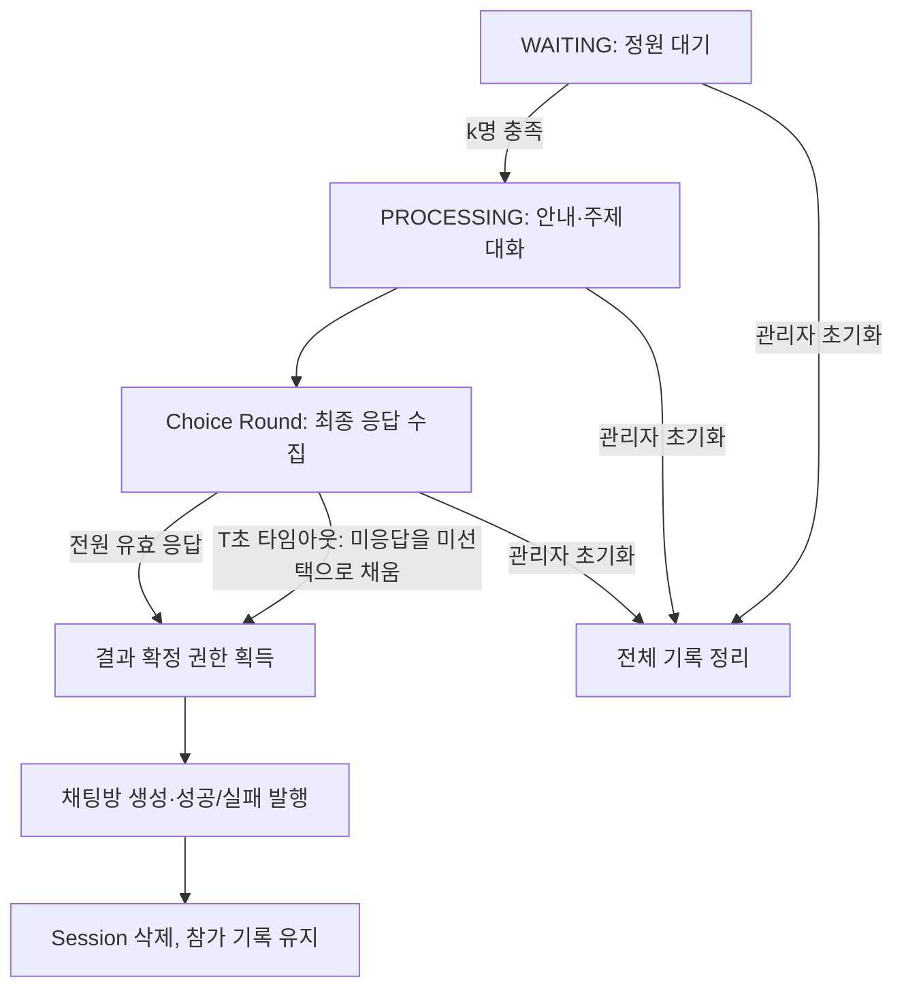

# BlindDate

## 책임

익명 과팅의 참가자 배정, 대화 진행, 선택 접수, 상호 선택 판정과 결과 이벤트를 관리한다.
채팅방 생성과 이후 대화는 Chat 도메인에 위임한다.

## Terminology

- Session: 참가자가 함께 대화하고 선택하는 과팅 단위.
- Choice: 참가자가 한 번 제출하는 최종 상대 선택. `targetId: null`은 명시적인 미선택이다.
- Match: 두 참가자가 서로 선택한 결과.
- Choice Round: 참가자 목록 발행 전에 시작하여 전원 최종 응답 또는 타임아웃을 기다리는 단계.

## 주요 흐름과 규칙

정원 충족 → 안내 및 대화 → Choice Round 개설과 참가자 목록 발행 →
전원 최종 응답 또는 30초 타임아웃 → 상호 선택 계산과 채팅방 생성 → 성공·실패 결과 일괄 발행 → 세션 종료.

프론트가 10초 선택 시간을 관리하고 종료 후 각 참가자의 최종 Choice를
`/app/blinddate/choice`에 제출한다. 본문은 `{"targetId":123}` 또는 미선택의 경우
`{"targetId":null}`이다. 선택자와 세션은 인증된 소켓 속성에서 가져온다.
기존 DTO에서는 targetId가 누락된 `{}`도 null로 역직렬화되어 미선택으로 접수된다.

서버는 참가자 목록 발행 후 30초 타임아웃을 둔다. 참가자 목록을 발행하기 전에 응답 대상을 고정한다.
연결이 끊긴 참가자도 응답 대상에 남고 타임아웃 전에 재접속하여 제출할 수 있다.
30초 후에는 미응답만 null로 채우고 기존에 받은 선택은 유지하여 결과를 확정한다.
타이머 등록 실패 시 즉시 미응답을 미선택으로 확정해 세션이 계속 남는 것을 방지한다.
타이머 콜백과 선택 요청은 같은 세션 큐의 제출 순서로 처리하므로 타이머가 지연되면 추가 응답이
접수될 수 있다. 엄격한 30초 도착 기한을 보장하는 정책은 아니다.
운영 종료 후 기존 30분 정리 또는 관리자 초기화로 참가 기록을 정리한다.
서버는 클라이언트의 10초 경과를 검증하지 않으므로 접수가 열린 직후 제출된 요청도 유효하다.

회원별 최초 유효 응답만 반영한다. 미선택 역시 응답이며 이후 상대 선택으로 변경할 수 없다.
중복 응답은 인원수에 포함하지 않는다. 전원 응답 또는 타임아웃 전에는 매칭 결과를 노출하거나 채팅방을 만들지 않는다.

## 선택 입력 검증과 오류 응답

선택자와 대상은 Choice Round에 고정된 참가자 목록에 속해야 한다.
미선택은 유효하며 자기 선택은 허용하지 않는다. 잘못된 응답은 최초 응답 기회를 소비하지 않는다.
접수 시작 전이나 결과 확정 이후의 요청은 무시한다.

오류는 연결을 종료하는 STOMP ERROR 대신 개인별
`/topic/blinddate/session/{sessionId}/member/{memberId}/choice-error`에 전달한다.
응답 필드는 `status`, `code`, `message`이다.

| 조건 | status | code |
| --- | --- | --- |
| 선택자가 해당 Choice Round의 참가자가 아님 | 403 | CHOICE_FORBIDDEN |
| 자기 자신 선택 | 400 | INVALID_CHOICE |
| 해당 Choice Round에 대상이 없음 | 404 | CHOICE_TARGET_NOT_FOUND |

## 저장 구조와 동시성

`BlindDateParticipantStorageImpl`의 `sessionId → ChoiceRound`가 고정 참가자 목록,
회원별 응답과 `processing` 멱등 상태를 함께 관리한다. 미응답과 미선택은 `containsKey`로 구분한다.
세션별 잠금 안에서 응답 검증·최초 응답 기록·전원 응답 검사·`processing=true`를 원자적으로 처리한다.
전원 응답 요청과 타임아웃은 같은 processing 상태를 사용하며 한 호출만 처리 권한을 얻는다. 결과 확정 후에도 상태를 초기화하지 않아 재처리하지 않는다.
참가자 입장 기록과 함께 운영 정리·관리자 초기화에서 전체 삭제한다.

`BlindDateEventQueue`는 참여 이벤트를 전역 단일 스레드에서, 선택과 결과 확정은 세션별 직렬 큐에서
처리한다. 전원 응답을 받은 요청 또는 타임아웃은 접수를 닫고 같은 세션 큐에 결과 확정을 제출한다.
접수 개설과 전체 초기화는 같은 잠금에서 조정한다. 초기화가 대기·실행 중이면 새 접수 개설을
거부하며, 초기화 후에는 현재 세션 상태를 다시 검사해 종료된 세션을 다시 열지 않는다.
미리 큐에 들어온 중복 요청도 `processing` 상태로 무시된다. 다른 세션은 5개의 공용 worker에서 병렬 실행한다.

각 상호 선택 쌍은 회원 ID 순서로 한 번만 채팅방을 생성한다. 모든 채팅방 생성 시도가 끝난 뒤
기존 개인별 chatroom 토픽에 성공을 보내고 나머지 참가자의 failed 토픽에 실패를 보낸다.
일괄 발행은 전원 결과를 한 단계에서 처리한다는 의미이며 한 개의 브로드캐스트 payload로 변경하지 않는다.

## 제약과 실패 처리

상태와 큐는 프로세스 내부에 있다. 다중 서버 처리와 재시작 복구는 지원하지 않는다.
`processing`은 한 프로세스 안의 중복 실행 방지이며 DB와 소켓 전송의 분산 트랜잭션을 보장하지 않는다.

채팅방 생성이 실패하면 해당 쌍에게 실패 결과를 보내고 다른 쌍은 계속 처리한다.
개인별 전송 예외를 각각 기록하여 나머지 수신자 전송을 계속하며 마지막에는 세션을 종료한다.
DB 커밋 후 호출 실패처럼 외부 작업의 성공 여부가 불명확한 경우의 보상은 포함하지 않는다.
결과 재전송·클라이언트 수신 확인은 제공하지 않는다. 전송 호출 반환은 실제 수신을 뜻하지 않는다.

느린 채팅방 생성은 같은 세션의 결과를 지연시키고 공용 worker가 모두 점유되면 다른 세션도 대기한다.
전원 응답 전에 빠른 성공을 보내던 클라이언트는 이 정책과 호환되지 않으므로 프론트 전환과 함께 적용한다.

## 전체 진행 계약

### 시간·인원 기호와 현재 값

| 기호 | 의미 | 현재 구현 | 설정 위치 / 소유자 |
| --- | --- | --- | --- |
| k | 세션 정원 | 개최 요청의 `maxSessionMemberCount` | `StartBlindDateRequest` |
| n | 이벤트별 대화 시간(분) | 3분 | Scheduler의 `CHATTING_TIME`, 상수이며 런타임 설정 아님 |
| a | 요청한 이벤트 메시지 수 | 기본 3개 | `blinddate.event-message-amount` |
| a′ | 실제 이벤트 메시지 수 | `min(a, 8)` | MessageProvider의 주제 8개에서 중복 없이 무작위 선정 |
| m | 프론트 선택 UI 시간(초) | 10초로 합의 | 프론트 책임, 이 저장소에서 실제 UI 동작을 검증하지 않음 |
| T | 서버 미응답 타임아웃(초) | 30초 | Scheduler의 `CHOICE_TIMEOUT` |
| g | 전송 여유 시간(초) | 현재 T−m = 20초 | 후보 정책에서는 2초 |

`n`, `a`, `m`은 서로 다른 값이다. `n`분 대화를 a′회 진행한 뒤 m초 선택 UI를 제공한다.
서버는 UI 선택 시간을 재지 않고 최종 요청을 기다린다. a는 주제 풀 크기까지만 반영된다.
a=0 또는 음수는 정상 진행 계약이 아니며, 현재 코드가 빈 주제의 첫 항목을 접근하거나
잘못된 subList 범위를 만들 수 있다. 유효한 설정 범위와 동적 안내 문구는 후속 구현 검토 대상이다.

### 상태와 단계

저장된 SessionState는 `WAITING`, `PROCESSING`이다. 종료 시 Session을 삭제한다.
아래 안내·대화·선택·결과 확정은 설명용 단계이며 별도 저장된 enum 상태가 아니다.

운영 종료 후 지연 정리도 전체 기록 정리 경로를 사용한다. 외부 작업 실행 중 초기화는
앞서 제출된 세션 작업 완료를 기다리므로 즉시 중단·롤백하는 기능은 아니다.

### 정상 진행 순서

1. 인증된 소켓이 `/user/queue/blinddate/join`을 구독하면 입장을 요청한다.
2. 참여 큐에서 회원의 기존 참가 기록을 확인하고 대기 Session을 배정한다.
   입퇴장은 같은 단일 스레드 큐에 제출되어 하나씩 직렬 처리된다.
   `execute()`가 입장 완료까지 기다리는 동기 API는 아니며, 네트워크 도착 순서를 별도로 보장하지 않는다.
3. 새 회원을 등록하고 개인 JOIN 응답으로 sessionId·익명 이름·현재 인원·정원을 전달한다.
4. 정원 미달이면 `joined`로 인원을 갱신한다. 마지막 회원이 k명을 채우면 Session을
   PROCESSING으로 전환하고 별도 진행 스레드에서 시작한다. 마지막 입장은 JOIN 후
   시작 경로로 진입하므로 `joined`가 k명으로 한 번 더 발행된다고 가정하지 않는다.
5. 구독 여유 1초 → START → 추가 1초 → FREEZE 순서로 진행한다.
6. 안내 메시지 7개를 SYSTEM으로 순서대로 보내며 각 발행 뒤 2초씩 기다린다.
7. 첫 주제에서 FREEZE → SYSTEM(주제) → 4초 후 THAW를 발행한다.
   THAW부터 n분 대화한 뒤 다음 주제로 넘어간다. 다음 주제도 같은 순서를 반복한다.
   주제 발행 간격은 정확히 n분이 아니라 대체로 **n분 + 읽기 대기 4초**다.
8. a′번째 주제의 THAW 후에도 n분 대화하고 Choice Round를 연다.
   응답 대상을 고정하고 접수를 연 뒤 `participants`를 발행한다.
9. 프론트는 participants 수신을 선택 시작 신호로 사용하고 m초 UI를 제공한다.
   UI 종료 후 각 참가자가 최종 targetId 또는 null을 한 번 제출한다.
   미선택도 반드시 제출한다. 프론트가 보내지 않은 요청은 서버에서 미응답이다.
10. 모든 유효 응답이 모이면 T를 기다리지 않고 확정한다. 누군가 미응답이면
    타임아웃에서 미응답만 null로 채운 뒤 같은 결과 확정 경로를 실행한다.
11. 상호 선택 쌍별로 채팅방 생성이 끝난 뒤 성공 결과, 이어서 나머지 실패 결과를 발행하고 Session을 삭제한다.
    참가 기록은 재입장 방지를 위해 유지한다. 결과의 수신 확인이나 재접속 시 재전송은 없다.

기본 a=3, n=3이면 주제 대화만 9분이다. 구독 여유 2초 + 안내 대기 14초 + 주제 읽기
대기 12초를 포함하면 선택 목록 발행까지 명목상 약 **9분 28초**다. 작업 지연·전송 소요는 별도다.
현재 안내에 포함된 “15분간 진행”, “총 3개의 질문”은 고정 문자열이므로 실제 시간 또는
변경된 a와 일치한다고 보장하지 않는다. 이 문서 PR에서는 해당 문구나 운영 코드를 바꾸지 않는다.

### 소켓 방향과 의미

아래 Session 토픽은 `/topic/blinddate/session/{sessionId}`에 상대 경로를 붙인다.

| 방향 | 목적지 / 상대 경로 | 의미 / 주요 payload |
| --- | --- | --- |
| 클라이언트 SUBSCRIBE | `/user/queue/blinddate/join` | 입장 요청 트리거 및 JOIN 응답 구독 |
| 서버 → 개인 | 위 JOIN 구독 경로 | name, sessionId, state, volunteer, maxCount; 실패·종료는 state만 전달 가능 |
| 서버 → Session | `/joined` | 인원 갱신, `volunteer` |
| 서버 → Session | `/start` | 진행 시작, `sessionId` |
| 서버 → Session | `/freeze`, `/thaw` | UI 대화 비활성화·활성화, `type` |
| 서버 → Session | `/system` | 안내·주제, message, senderId=0, senderName, timestamp |
| 클라이언트 SEND | `/app/blinddate/message` | 사용자 대화, message |
| 서버 → Session | `/message` | 사용자 대화, message, senderId, senderName, timestamp |
| 서버 → Session | `/participants` | **선택 UI 시작 신호**, participants(회원 ID → 익명 이름) |
| 클라이언트 SEND | `/app/blinddate/choice` | **최종 선택 응답**, `targetId` 또는 null; 서버가 보낸 choice 이벤트 아님 |
| 서버 → 개인 | `/member/{memberId}/choice-error` | 잘못된 입력, status/code/message; 최종 실패 아님 |
| 서버 → 개인 | `/member/{memberId}/chatroom` | 성공, `chatRoomId` |
| 서버 → 개인 | `/member/{memberId}/failed` | 실패, message |

FREEZE/THAW는 UI 제어 이벤트다. 현재 MessageHandler는 회원의 익명 이름 존재 여부만
확인하고 브로드캐스트하며, 서버에서 FREEZE 상태나 선택 단계·종료 여부를 강제 검사하지 않는다.
또한 마지막 주제 종료 시 별도 FREEZE를 발행하지 않는다. “선택 중 채팅 금지”를 서버의
보안 보장으로 해석하면 안 된다. 정확한 단계별 전송 제한은 후속 정책·구현 검토 사항이다.

## 시나리오 목록

각 행은 QA·후속 테스트에 사용할 입력과 관찰 결과다. 아래 목록 전체가 자동 테스트로
검증됐다는 뜻은 아니다. 현재 코드의 관찰 결과와 별도 검토가 필요한 한계도 함께 표시한다.
ID는 문서 시나리오 ID이며 테스트 메서드 이름에 결합하지 않는다.

### 입장·퇴장·세션 배정

| ID | 조건 / 행동 | 현재 기대 결과 또는 한계 |
| --- | --- | --- |
| J01 | 운영 중 첫 회원 입장 | 새 WAITING Session과 익명 이름 배정, 개인 JOIN 응답 |
| J02 | k−1명까지 순서대로 입장 | 같은 대기 Session에 배정, 시작하지 않음 |
| J03 | k번째 회원 입장 | 정원을 충족한 Session을 PROCESSING으로 전환하고 진행 시작 |
| J04 | 꽉 찬 Session 뒤 새 회원 입장 | 새 대기 Session을 만들어 배정, 기존 Session에 추가하지 않음 |
| J05 | 여러 회원이 동시에 입장 | 참여 큐의 실행 순서로 배정, 소켓 수가 아니라 회원 수로 정원 판단 |
| J06 | 같은 회원의 두 번째 소켓 입장 | 같은 Session·익명 이름, 소켓만 추가; 인원 증가 없음 |
| J07 | 같은 소켓의 입장 요청 반복 | 소켓 집합은 중복 등록되지 않음; JOIN 재응답은 가능 |
| J08 | WAITING 회원의 소켓 하나 해제, 다른 소켓 존재 | 소켓만 제거, 참가자·인원 유지 |
| J09 | WAITING 회원의 마지막 소켓 해제 | 참가자 제거, 인원 갱신; 정원 미달 상태 유지 |
| J10 | 마지막 입장과 퇴장이 동시에 제출됨 | 참여 큐 순서에 따라 시작 여부 결정; 먼저 시작하면 뒤의 해제는 진행 중 이탈로 처리 |
| J11 | PROCESSING 회원의 마지막 소켓 해제 | 연결만 제거, 참가자·고정 응답 대상 유지; 이탈 즉시 미선택 처리하지 않음 |
| J12 | 진행 중 이탈 회원 재접속 | 기존 Session·익명 이름 복구, 소켓 역인덱스 갱신, JOIN 재응답 |
| J13 | 종료된 Session 참가 회원 재접속 | JOIN에 TERMINATED 안내, 새 Session에 자동 편입하지 않음 |
| J14 | 알 수 없는 소켓·중복 해제 | 다른 회원을 제거하지 않음, 찾을 수 없는 소켓은 로그 후 종료 |
| J15 | 참가 등록 전 예외 | JOIN에 실패한 요청의 sessionId 속성 제거, 기존 정상 참가자를 삭제하지 않음 |
| J16 | 참가 등록 후 JOIN 전송·정원 조회 실패 | FAILED 안내를 시도하고 퇴장 큐에 롤백 제출; 요청 반환 시 즉시 롤백 완료를 보장하지 않음 |
| J17 | 운영하지 않을 때 입장 | 입장 거부; 현재 실행 진입 전 가용성을 검사 |
| J18 | 가용성 검사 이후 운영 종료, 입장 작업은 이미 큐에 있음 | 처리 시 가용성 재검사가 없어 종료 직전 접수의 편입 가능성은 남아 있음 |
| J19 | PROCESSING 소켓 해제와 Choice Round 개설이 겹침 | 참가자 기록이 유지되므로 응답 대상에서 빠지지 않음 |
| J20 | 종료 후 소켓 해제 | 현재 DisconnectHandler는 삭제된 Session이면 바로 반환; 소켓 기록 정리까지 보장하지 않음 |

### 안내·이벤트·대화

| ID | 조건 / 행동 | 현재 기대 결과 또는 한계 |
| --- | --- | --- |
| P01 | 정원 충족 | 구독 여유 후 START, 이후 FREEZE·안내 메시지 순차 발행 |
| P02 | 정상 안내 진행 | 7개 안내가 2초 대기로 순서대로 발행; 안내 중 UI 대화 비활성화 |
| P03 | 주제 하나 발행 | FREEZE → SYSTEM 주제 → 4초 뒤 THAW |
| P04 | 주제 대화 n분 종료, 다음 주제 존재 | 다음 FREEZE·주제·THAW 진행; 무작위 선정한 주제의 순서대로 발행 |
| P05 | a′번째 주제 발행 | 주제를 보내자마자 선택을 시작하지 않고, THAW 후 n분 대화까지 제공 |
| P06 | 마지막 대화 종료 | 응답 대상 고정·접수 개설 후 participants 발행, 최종 선택 요청 수집 |
| P07 | a가 주제 풀 크기보다 큼 | 실제 a′는 8개, 요청한 수만큼 새 주제를 생성하지 않음 |
| P08 | a가 0 또는 음수 | 정상 진행을 보장하지 않음; 설정 검증 필요 |
| P09 | FREEZE 중 임의 클라이언트가 메시지 SEND | UI는 막을 수 있으나 서버의 단계 검사로 차단되지 않음 |
| P10 | 선택 중·종료 후 기존 속성으로 메시지 SEND | MessageHandler의 Session 상태 검사가 없어 차단을 보장하지 않음 |
| P11 | 진행 중 재접속 | JOIN 재응답만 있으며 이전 안내·현재 주제·remaining time을 재전송하지 않음 |
| P12 | 스케줄러 실행 지연 | 다음 이벤트와 선택 시작이 늦어질 수 있음; 절대 시각 기반 진행 보장 없음 |
| P13 | 안내 진행 스레드 중단 또는 진행 이벤트 전송 예외 | Session 종료 작업 제출; 참가자별 최종 실패 이벤트를 모두 보낸다는 보장 없음 |
| P14 | 이미 정리된 Session의 오래된 이벤트 작업 | 상태 검사 경로에서 중단할 수 있으나 모든 THAW·전송의 원자적 차단을 보장하지 않음 |

### 선택 입력·응답 수집

| ID | 조건 / 행동 | 현재 기대 결과 또는 한계 |
| --- | --- | --- |
| C01 | Choice Round 개설 전 최종 선택 제출 | 접수하지 않음; 참가 등록만으로 선택 가능하지 않음 |
| C02 | participants 발행 직후 즉시 최종 선택 제출 | 서버는 m초 경과를 검증하지 않으므로 최초 유효 응답으로 접수 |
| C03 | m초 UI 종료 후 대상 한 명 제출 | 본인 회원 ID 기준으로 한 응답 저장; 전원 응답 전까지 결과 발행 없음 |
| C04 | `targetId:null` 제출 | 명시적인 미선택 응답으로 인원수에 포함 |
| C05 | targetId가 누락된 `{}` 제출 | 기존 DTO 역직렬화에서 null, 미선택으로 접수 |
| C06 | 아무 요청도 보내지 않음 | 미응답; 유효한 미선택 응답과 구분하고 T까지 기다림 |
| C07 | 동일 회원의 선택·미선택 요청 반복 | 응답 수는 한 명, 최초 유효 응답 유지 |
| C08 | 상대 A를 제출 후 상대 B로 변경 | 첫 응답 A 유지; 서버가 UI 중간 선택을 저장하는 정책 아님 |
| C09 | 미선택 제출 후 상대 선택으로 변경 | 첫 미선택 유지 |
| C10 | 자기 자신 선택 | choice-error에 400 / INVALID_CHOICE; 정상 응답 기회는 유지 |
| C11 | 해당 Choice Round 참가자가 아닌 선택자 | choice-error에 403 / CHOICE_FORBIDDEN |
| C12 | 없는 회원 또는 다른 Session의 상대 선택 | choice-error에 404 / CHOICE_TARGET_NOT_FOUND |
| C13 | 잘못된 선택 후 정상 선택 제출 | 잘못된 입력을 인원수에 넣지 않고 정상 최초 응답 접수 |
| C14 | 대상의 모든 소켓이 해제됨 | 고정 참가 목록에 있으므로 선택 대상 허용; 해당 대상 응답은 별도로 필요 |
| C15 | 같은 회원의 여러 소켓이 동시에 제출 | 첫 유효 응답 하나만 반영, 소켓별로 응답 수를 늘리지 않음 |
| C16 | 마지막 유효 응답 도착 | processing 권한 획득·새 접수 차단·결과 확정 한 번 |
| C17 | 결과 확정 중 또는 종료 뒤 추가 응답 | 무시; 실패를 늦은 성공으로 뒤집거나 채팅방을 재생성하지 않음 |
| C18 | 서로 다른 Session에서 동시에 제출 | Session별 독립 수집, 한 Session 미응답이 다른 Session 확정을 막지 않음 |
| C19 | participants 또는 choice-error 전송 실패 | 실패를 기록; 목록은 재전송하지 않으며 응답하지 못한 회원은 타임아웃 미선택 가능 |

### 매칭 결과·타임아웃·외부 실패

| ID | 조건 / 행동 | 현재 기대 결과 또는 한계 |
| --- | --- | --- |
| R01 | A→B, B→A, 전원 응답 | 해당 쌍의 채팅방 하나, 두 성공 이벤트 |
| R02 | A→B, B→null | 상호 선택 없음, 둘 다 실패 |
| R03 | A→B, B→C, C→A | 순환 선택은 상호 선택이 아니므로 전원 실패 |
| R04 | 전원 미선택 응답 | 마지막 응답 직후 전원 실패, T까지 기다리지 않음 |
| R05 | 선택이 한 회원에게 집중 | 그 회원과 상호 선택한 쌍만 성공; 나머지 실패 |
| R06 | 4명에서 A↔B, C↔D | 채팅방 둘, 전원 성공 |
| R07 | 5명에서 두 쌍 상호 선택, 한 명 미선택 | 채팅방 둘, 네 성공·한 실패 |
| R08 | A↔B 응답 완료, C 미응답 | T 전까지 채팅방·결과 없음; T에서 C만 null로 채워 A/B 성공·C 실패 |
| R09 | 전원 미응답 | T에서 전원 null로 채워 실패, Session 종료 |
| R10 | 일부 응답 후 나머지 회원 이탈 | 이탈 즉시 확정하지 않고 T에서 미응답만 null 처리 |
| R11 | 타임아웃 전 재접속·최종 응답 | 접수가 열려 있으면 정상 최초 응답 접수; UI 남은 시간 복구는 별도 문제 |
| R12 | 최종 응답과 타임아웃이 동시에 실행됨 | 같은 processing 상태와 Session 큐로 한 호출만 결과 확정 |
| R13 | 타이머 중복 실행 또는 전원 응답 후 오래된 타이머 | 결과·채팅방 추가 생성 없음 |
| R14 | 타임아웃 뒤 늦은 응답 | 접수가 닫혔으면 무시; 기존 결과 유지 |
| R15 | 타이머 실행이 지연됨 | 콜백 제출 전에 받은 요청은 접수 가능; T는 엄격한 도착 기한이 아님 |
| R16 | 한 쌍 채팅방 생성이 느림 | 같은 Session 결과는 기다림; 다른 Session은 공용 worker 여유 범위에서 진행 |
| R17 | 한 쌍 채팅방 생성 실패 | 해당 쌍 실패, 다른 쌍 처리 계속; DB 커밋 뒤 예외의 보상은 없음 |
| R18 | 한 회원 성공·실패 이벤트 전송 실패 | 다른 회원 전송 계속, 마지막에는 Session 종료; 자동 재전송 없음 |
| R19 | 결과 생성 중 중복 choice 요청 | 저장된 processing으로 무시, 추가 채팅방 없음 |
| R20 | 타임아웃 예약 등록 실패 | 즉시 타임아웃 경로 실행, 미응답 미선택 처리 |
| R21 | 서버 프로세스 재시작·여러 인스턴스 분산 | 현재 인메모리 상태로 복구·분산 멱등을 보장하지 않음 |

### 운영 종료·초기화

| ID | 조건 / 행동 | 현재 기대 결과 또는 한계 |
| --- | --- | --- |
| O01 | 개최 만료 시각 도달 | 신규 입장 가용성을 끄고 기존 Session은 즉시 전체 삭제하지 않음 |
| O02 | 만료 후 30분 경과 | 운영 정보 닫기, 선택 접수 차단·세션 작업 대기·전체 Session/참가 기록 정리, 예약 작업 취소 |
| O03 | 운영 중 관리자 참가 기록 초기화 | 운영 상태·자동 종료 예약 유지, 포인터·Session·참가/응답 기록 정리 |
| O04 | 초기화와 Choice Round 개설 경합 | 초기화 대기·실행 중 개설 거부; 이후 현재 Session 상태를 다시 검사 |
| O05 | 초기화와 결과 처리 경합 | 이미 실행 중인 세션 작업 완료를 기다림; 외부 채팅방 생성을 취소하거나 롤백하지 않음 |
| O06 | 초기화 후 오래된 choice·타임아웃 요청 | 기존 접수·Session 상태가 사라져 새 매칭을 생성하지 않음 |
| O07 | 초기화 후 새 입장 | 운영 중이면 새 Session 배정 가능, 과거 참가 기록으로 재입장을 막지 않음 |
| O08 | 개최 종료 예약 등록 실패 | 운영 상태 닫고 개최 실패; 알림 발송 실패만으로 개최를 취소하지는 않음 |

## 30초와 12초 타임아웃 검토

### 현재 구현과 변경 후보

이 문서는 **현재 T=30초**를 기록한다. **T=12초는 제안이며 아직 운영 코드에 적용하지 않는다.**
투표를 완료한 사용자가 느끼는 결과 대기는 “목록 발행 후 T초”가 아니라, 자신의 m초 UI 종료 후
서버가 나머지를 기다리는 시간이다. 이탈자가 미응답이면 현재 명목상 20초를 더 기다릴 수 있다.

| 정책 | 프론트 UI | 서버 확정 조건 | 미응답 시 UI 종료 후 명목 대기 | 장점 | 비용 |
| --- | --- | --- | --- | --- | --- |
| 현재 30초 | m=10초 | 전원 응답 또는 T=30초 | 약 20초 | 수신·전송 지연, 재접속에 여유 | 이탈자 때문에 결과가 오래 대기 |
| 제안 12초 | m=10초 | 전원 응답 또는 T=m+g=12초, g=2초 | 약 2초 | 이탈 상황의 결과 대기 감소 | 느린 정상 응답도 미선택으로 확정될 수 있음 |
| 이탈 즉시 미선택 | m=10초 | 연결 상태로 미응답을 즉시 확정 | 이탈 처리 시점에 따라 다름 | 빠른 확정 가능 | 모바일 순간 단절·다중 소켓·재접속을 최종 포기로 오판 가능 |

대화 흐름에는 **12초 = 10초 UI + 2초 전송 여유**가 더 자연스럽다.
다만 선택 UI는 각 클라이언트의 participants **수신 시점**, 서버 타이머는 participants
**발행 호출 반환 후 예약 시점**을 기준으로 한다. 기준 시점이 같지 않으므로 2초는
응답 전송만이 아니라 목록 전달 지연·클라이언트 처리 지연·반환 전송·큐 제출 여유를 함께 감당해야 한다.
12초 타이머가 종료돼도 느린 DB·이벤트 전송·worker 부족 때문에 결과 수신까지 12초를 보장하지 않는다.

예: 서버가 목록을 발행하고 클라이언트가 1.5초 뒤 받으면, 클라이언트가 10초를 투표한 뒤
0.8초에 응답을 전송해 서버에 도착하는 시점은 약 12.3초다. 서버가 12초에 접수를 닫았다면
정상 사용자라도 미선택으로 확정된다. 반대로 타이머가 지연되면 이 응답이 접수될 수도 있다.

### 12초를 적용할 때 합의할 계약과 QA

- 서버 기준 T와 프론트 UI 기준 m을 명확히 분리한다. 서버의 T를 클라이언트별 10초 보장으로 설명하지 않는다.
- 선택 종료 후에는 실제 선택과 미선택 모두 최종 요청을 보낸다. UI 중간 선택을 현재 API에 전송하면 최초 선택으로 굳는다.
- 최종 응답이 없으면 null로 확정한다. 이미 제출한 정상 선택은 유지하고 상호 선택 결과는 동일하게 계산한다.
- 최종 응답·타임아웃·중복 콜백은 같은 멱등 경로로 처리한다. 늦은 응답으로 결과를 뒤집지 않는다.
- 목록 수신 지연 0/1/2초, 응답 지연, 순간 연결 해제·재접속, 여러 소켓, 타이머·worker 지연을 포함해 QA한다.
- 결과를 받은 프론트는 남아 있는 로컬 선택 타이머를 정리하고 선택 UI를 종료한다. 서버 수신 확인·ACK 계약은 현재 없다.
- 서버가 절대 기한을 payload로 제공하는 방식은 기준 시점 공유에 도움이 되지만, 시계 오차·늦은 목록 수신과 UI 축소 정책을 함께 정해야 한다. 현재 payload에는 해당 필드가 없다.

12초 적용은 별도 코드 변경에서 타임아웃 상수·타이머 테스트·도메인 정책을 함께 수정해야 한다.
이 문서 PR은 값 변경을 결정하거나 프론트 동작이 검증됐다고 간주하지 않는다.

## 구현·검증 근거

| 영역 | 현재 코드 근거 | 기존 테스트 근거 / 범위 |
| --- | --- | --- |
| 참여 직렬 처리·정원·재접속 | `BlindDateEventQueue`, Connect/DisconnectHandler, SessionService | `BlindDateIntegrationTest`, `BlindDateConcurrencyTest`, `BlindDateRepositoryConcurrencyTest` |
| 안내·대화 간격·선택 전환 | `BlindDateSessionSchedulerImpl`, `BlindDateMessageProvider`, application.yml | `scheduler/BlindDateSessionSchedulerImplTest`는 선택 개설·30초 예약·종료 세션 검사 등, 전체 실시간 타이밍 E2E 아님 |
| 최종 응답·고정 참가자·멱등 | `repository/BlindDateParticipantStorageImpl` | `repository/BlindDateChoiceCollectionTest`, `repository/BlindDateChoiceValidationTest` |
| 잘못된 입력 개인 오류 | `BlindDateChoiceHandler` | `BlindDateChoiceErrorScenarioTest` |
| 성공·실패·타임아웃·부분 실패 | `BlindDateChoiceHandler` | `BlindDateMatchResultTest` |
| 초기화·큐 실행 순서 | `BlindDateEventQueue`, `BlindDateServiceImpl` | `executor/BlindDateEventQueueTest`, `service/BlindDateServiceTest` |
| 실제 모바일 UI·네트워크 전달 | 이 저장소에서는 m초 UI·수신 시각·수신 ACK를 검증하지 않음 | 수동·E2E QA 필요. 문서의 시나리오 목록과 자동 테스트 커버리지는 동일하지 않음 |

### 후속 검토가 필요한 보장

- 선택 시작의 송수신 이벤트 명칭과 프론트 10초 UI 계약, 12초 후보 적용 여부.
- 진행 단계별 서버 메시지 전송 제한과 선택 단계 시작 시 FREEZE 여부.
- 재접속 시 현재 주제·선택 가능 여부·남은 시간·최종 결과 복구.
- 안내 문구의 고정 15분·3개와 실제 설정의 불일치, 이벤트 수 유효 범위 검증.
- 운영 종료 직전 큐에 접수된 신규 입장의 가용성 재검사, 종료 후 소켓 역인덱스 정리.
- 채팅방 생성의 불명확한 부분 성공 보상, 이벤트 전달 확인·재전송, 다중 서버·재시작 복구.

위 항목은 현재 보장하지 않는 동작을 확인한 목록이다. 이 문서 PR에서 구현하거나 새 정책으로 확정하지 않는다.
